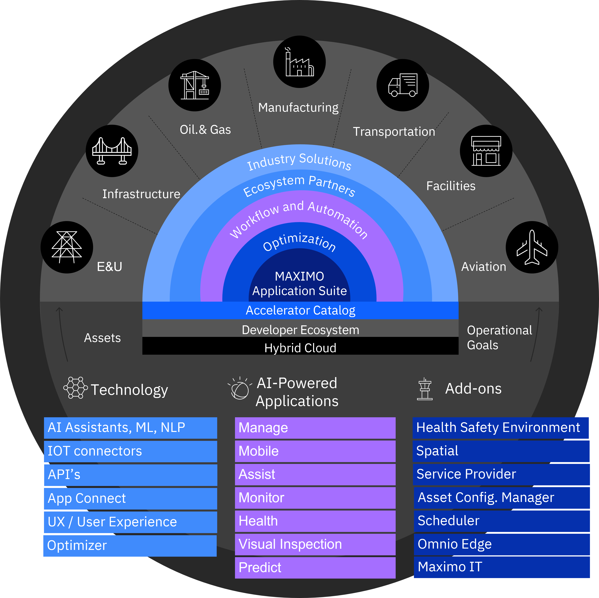

# 🏠 Home

This is the resources hub for the Maximo Application Suite (MAS). With those resources, you can be provided an overall about  MAS, which includes:&#x20;

* [Product introduction](mas-introduction/mas-overview.md)
* [Infrastructure](mas-infrastructure/infrastructure-overview.md)&#x20;
* [Upgrade from Maximo EAM](upgrade-to-mas/mas-upgrade-overview.md)
* [Modules](mas-modules-details/modules-overview.md)
* [Add-ons](mas-add-on/add-ons-overview.md)
* [Industries solutions](mas-industry-solutions/industry-solutions-overview.md)
* ... and [more](mas-add-on/in-depth-contents.md).

How to use this wiki:

* General information about MAS: Find the information you are interested in in the menu items on the left.
* If you need more details about MAS or other Avenue products and services, please find them in the [In-depth Contents ](mas-add-on/in-depth-contents.md)section or send your questions to the email address:  [presales@avenue-net.com](mailto:presales@avenue-net.com).

<figure><figcaption>
MAS Overview
</figcaption></figure>
